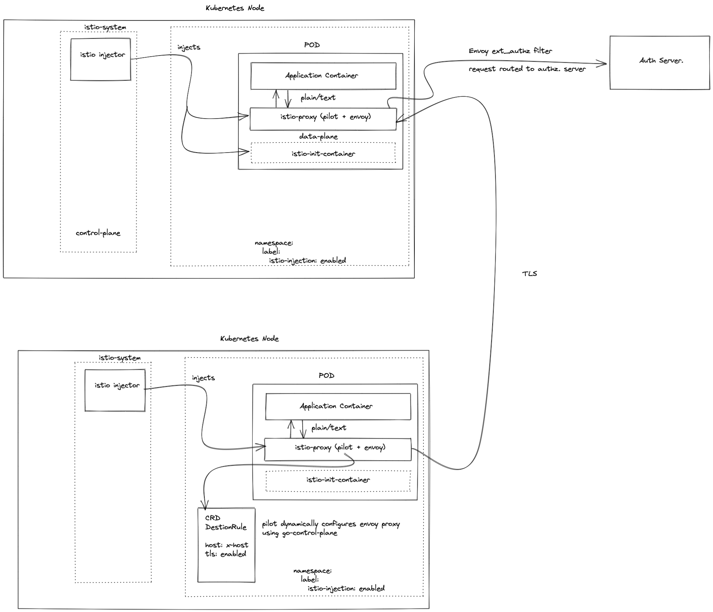

# envoy-go-control-plane
An example to dynamic configuration of Envoy Proxy using go-control-plane.

### Run Envoy Proxy With Control Plane

```docker run -it --rm -v "$PWD"/envoy-custom.yaml:/etc/envoy/envoy.yaml -p 9901:9901 -p 10000:10000 envoyproxy/envoy:v1.17.0```

### How Istio Use Envoy Proxy

